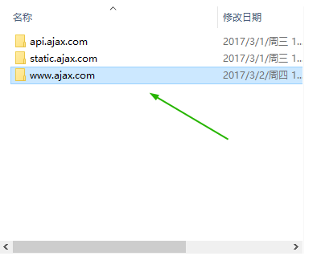
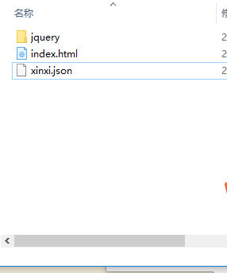
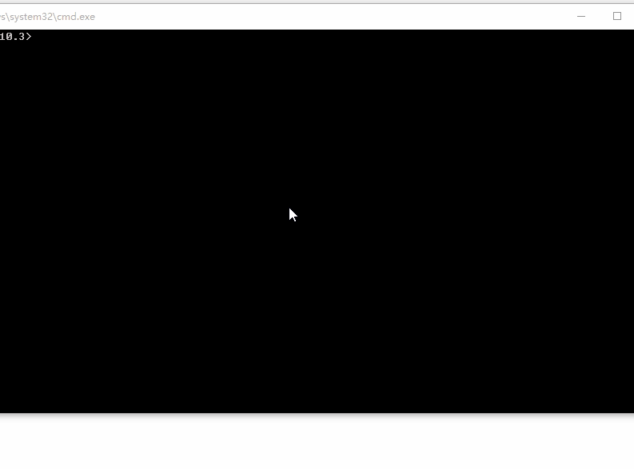

_ _ _
####10分钟秒懂ajax的同源与异步
　　==众所周知，Ajax在前端开发中扮演着常人所不能扮演的角色，正因为他的方便，他的健壮，才一步步挺到了今天！
　　Ajax是怎样获取数据，并且跨域请求的呢！我采用的是ajax+json来配置文件，在下边会与大家一一道来！==

一、同源
1.首先搭建代理服务器环境
- 1.我用的是nginx代理服务器，关于搭建这个环境推荐大家一个我朋友关于部署nginx环境的教程，
[http://www.cnblogs.com/changlel/p/6495623.html](http://www.cnblogs.com/changlel/p/6495623.html)
我环境已经配备好了，下面直接上硬货！
2.建立文件夹

我创建了三个服务器网址
3.我在www.ajax.html项目文件下建立了一个index.html
```css
<body>
  <table id="tb_xinxi">
    <tr>
      <th>姓名</th>
      <th>年龄</th>
      <th>性别</th>
    </tr>
  </table>
```
只需写出几行代码，最主要的是table标签加了一个id
4.建立一个json文件，下面有代码！

```json
[                                          //json书写方法
    {"name":"八戒","age":18,"sex":"男"},
    {"name":"嫦娥","age":18,"sex":"女"},
    {"name":"悟空","age":15,"sex":"男"},
    {"name":"沙僧","age":28,"sex":"男"},
    {"name":"师傅","age":58,"sex":"男"},
    {"name":"白马","age":48,"sex":"男"},
    {"name":"龙王","age":35,"sex":"男"}
  ]
```
5.我引入的是jQuery1.8.3库,引入链接用的是代理服务器书写方法
```css
<script type="text/javascript" src="http://static.ajax.com/js/doT.js"></script>
  <script type="text/javascript" src="http://static.ajax.com/js/doT.min.js"></script>
  <script type="text/javascript" src="http://static.ajax.com/js/jquery1.8.3.min.js"></script>
  <script type="text/javascript" src="http://static.ajax.com/js/index.js"></script>
```
6.js获取请求
```javascript
    //同源状况下请求数据
 $.ajax({
  url:"http://www.ajax.com/xinxi.json",
   success:function(data){
     var xinxis=data;

     for(i=0;i<xinxis.length;i++){
       xinxi=xinxis[i];
       var trstr="<tr><td>"+xinxi.name+"</td><td>"+xinxi.age+"</td><td>"+xinxi.sex+"</td></tr>";
        $("#tb_xinxis").append(trstr);
     }
   }
 });
```
我采用的是代理服务器，启动服务器，效果如下！

这样Ajax同源请求就成功了
二、异步请求（跨域）
　　同源请求大家都有所了解，跨步对于很多前端新手来说不怎么懂，下边看看代码
1.html代码没有区别跟上边相同！
```css
<body>
  <table id="tb_xinxi">
    <tr>
      <th>姓名</th>
      <th>年龄</th>
      <th>性别</th>
    </tr>
  </table>
```
2.js代码有差异，差别在于我把json文件用一个函数包含住了，看代码：
```javascript
//异域请求
 $.getJSON("http://api.ajax.com/xinxi.json?callback=?");请求地址又改变
 function callback(data){ //callback函数大家发现没有
   var xinxis=data;
   for(i=0;i<xinxis.length;i++){
     xinxi=xinxis[i];
     var trstr="<tr><td>"+xinxi.name+"</td><td>"+xinxi.age+"</td><td>"+xinxi.sex+"</td></tr>";
      $("#tb_xinxis").append(trstr);
   }
};
```
3.json代码，文件如下，被callback函数所包裹
```json
callback([
    {"name":"八戒","age":18,"sex":"男"},
    {"name":"嫦娥","age":18,"sex":"女"},
    {"name":"悟空","age":15,"sex":"男"},
    {"name":"沙僧","age":28,"sex":"男"},
    {"name":"师傅","age":58,"sex":"男"},
    {"name":"白马","age":48,"sex":"男"},
    {"name":"龙王","age":35,"sex":"男"}
  ]);
```
效果图同上！Ajax跨域与同源其实相差不大，跨域的时候记得给json文件添加个函数，这样就可以实现
